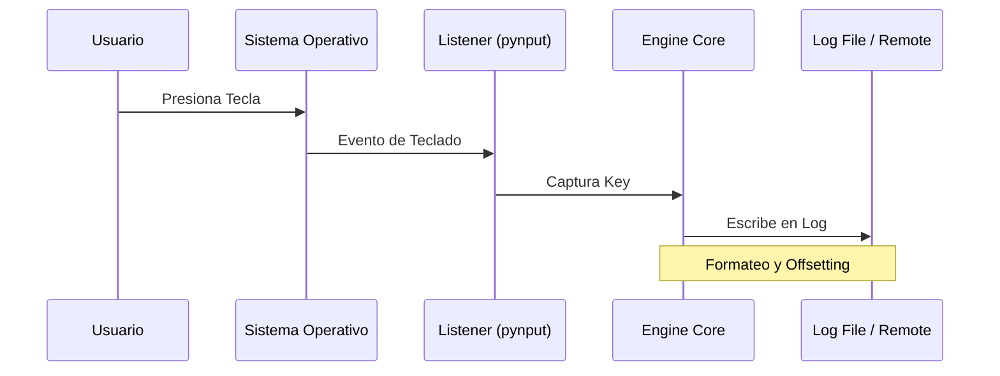

# Diagramas de Flujo del Proyecto

## Pipeline CI/CD (GitHub Actions)

```mermaid
graph LR
    A[Push al Repo] --> B[Stage: Lint]
    B --> C[Stage: Security Scan (Bandit)]
    C --> D[Stage: Test]
    D --> E{Exitoso?}
    E -- Sí --> F[Feedback Visual]
    E -- No --> G[Notificación de Fallo]
```

## Ciclo de Vida del Evento (Modo Activo)


